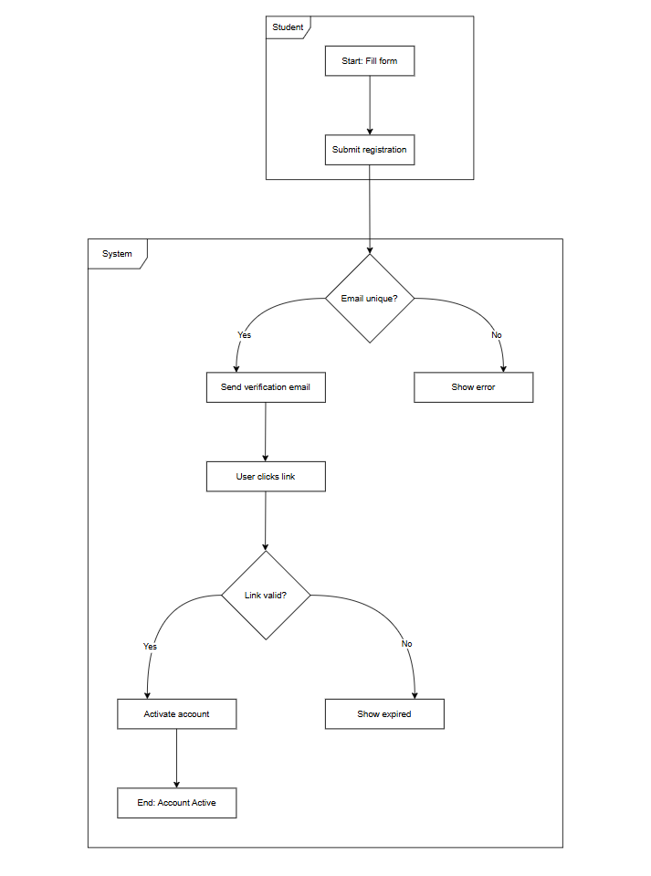
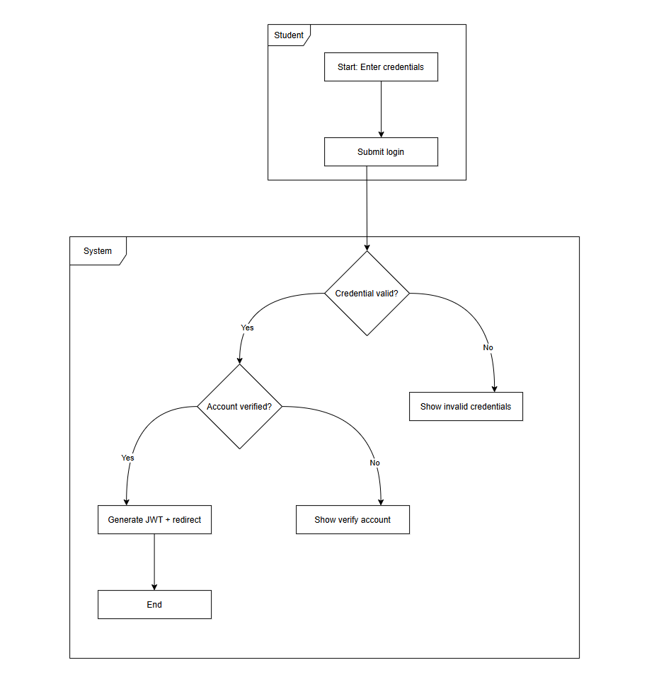
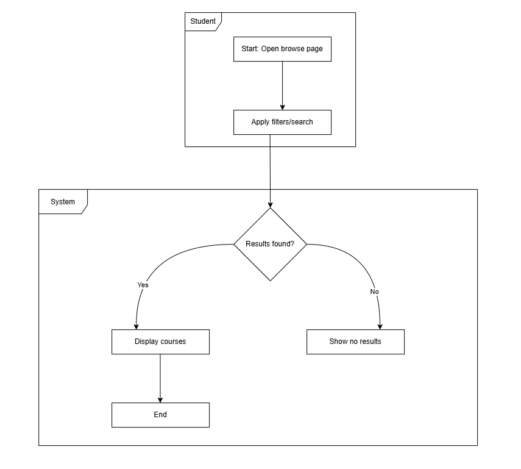
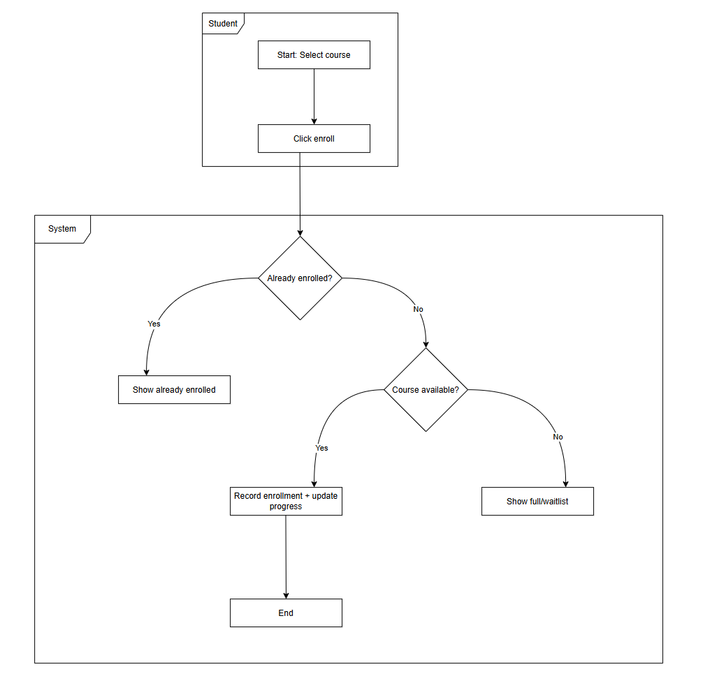
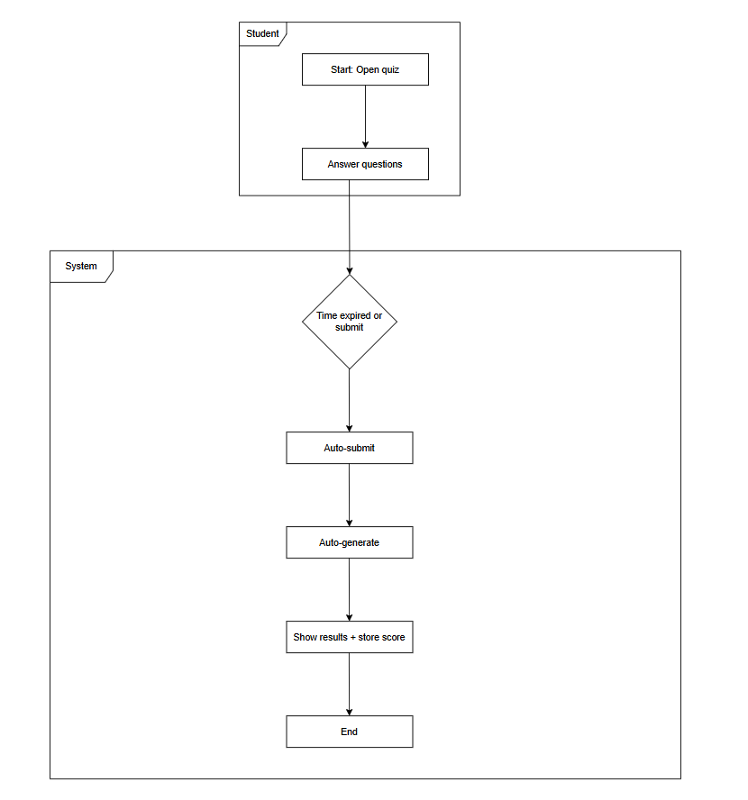
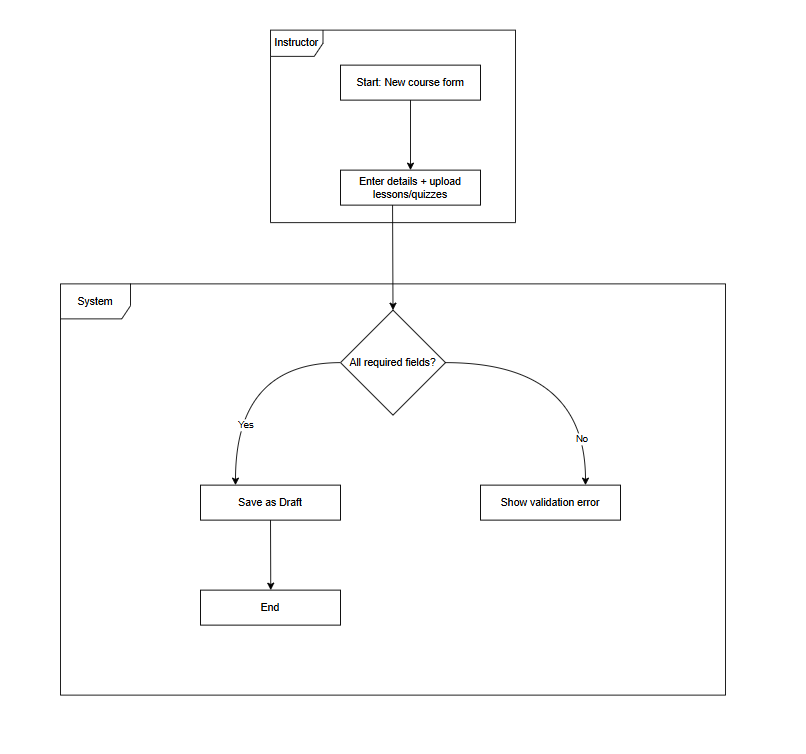
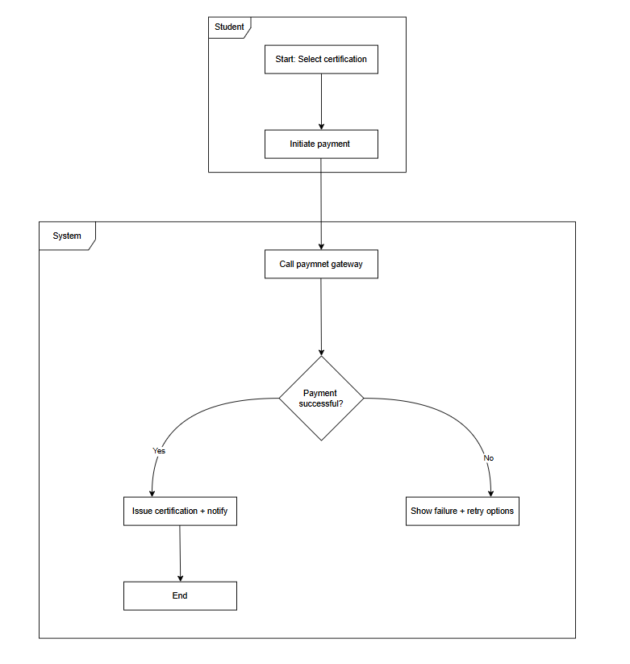

# ACTIVITY WORKFLOW MODELING WITH ACTIVITY DIAGRAM

## 1. Create User Account Activity Diagram (Swimlanes: Student, System)

**Detailed Explanation**  
* **Key Actions**: Fill registration form, submit details, send verification email, click verification link, activate account.  
* **Decisions & Branches**: Email unique & valid? / Link valid & not expired?  
* **Parallel Actions**: Account activation + welcome notification (real-time).  
* **How it addresses stakeholder concerns**: Ensures secure, accessible onboarding for students in underserved communities with instant feedback.  
* **Mapping to requirements**: **[FR-001 in SYSTEM-REQUIREMENTS.md](../SYSTEM-REQUIREMENTS.md)** and **[UC: Create User Account in USE-CASE-SPECIFICATIONS.md](../USE-CASE-SPECIFICATIONS.md)**. Supports **[US-001 in AGILE-PLANNING.md](../AGILE-PLANNING.md)**.

**[Open Editable draw.io File in Browser](https://app.diagrams.net/#Hkeo-codes/the-it-code-academy/main/Assignment%208/Activity-Workflow-Drawio-Files/create-user-account.draw.io)**

## 2. Login Activity Diagram (Swimlanes: Student, System)

**Detailed Explanation**  
* **Key Actions**: Enter credentials, submit login, generate JWT, redirect to dashboard.  
* **Decisions & Branches**: Credentials valid? / Account verified?  
* **Parallel Actions**: None (linear security checks).  
* **How it addresses stakeholder concerns**: Provides fast, secure access while protecting student data.  
* **Mapping to requirements**: **[FR-001 in SYSTEM-REQUIREMENTS.md](../SYSTEM-REQUIREMENTS.md)** and **[UC: Login in USE-CASE-SPECIFICATIONS.md](../USE-CASE-SPECIFICATIONS.md)**. Supports **[US-002 in AGILE-PLANNING.md](../AGILE-PLANNING.md)**.

**[Open Editable draw.io File in Browser](https://app.diagrams.net/#Hkeo-codes/the-it-code-academy/main/Assignment%208/Activity-Workflow-Drawio-Files/login.draw.io)**

## 3. Browse Courses Activity Diagram (Swimlanes: Student, System)

**Detailed Explanation**  
* **Key Actions**: Open browse page, apply filters/search, display courses.  
* **Decisions & Branches**: Results found?  
* **Parallel Actions**: None.  
* **How it addresses stakeholder concerns**: Makes course discovery intuitive and fast for busy students.  
* **Mapping to requirements**: **[FR-002 in SYSTEM-REQUIREMENTS.md](../SYSTEM-REQUIREMENTS.md)** and **[UC: Browse Courses in USE-CASE-SPECIFICATIONS.md](../USE-CASE-SPECIFICATIONS.md)**. Supports **[US-003 in AGILE-PLANNING.md](../AGILE-PLANNING.md)**.

**[Open Editable draw.io File in Browser](https://app.diagrams.net/#Hkeo-codes/the-it-code-academy/main/Assignment%208/Activity-Workflow-Drawio-Files/browse-courses.draw.io)**

## 4. Enroll Course Activity Diagram (Swimlanes: Student, System)

**Detailed Explanation**  
* **Key Actions**: Select course, click Enroll, create Enrollment, update progress.  
* **Decisions & Branches**: Already enrolled? / Course available?  
* **Parallel Actions**: Enrollment creation + progress initialization.  
* **How it addresses stakeholder concerns**: Prevents duplicate enrollments and gives instant progress visibility.  
* **Mapping to requirements**: **[FR-002 in SYSTEM-REQUIREMENTS.md](../SYSTEM-REQUIREMENTS.md)** and **[UC: Enrol Course in USE-CASE-SPECIFICATIONS.md](../USE-CASE-SPECIFICATIONS.md)**. Supports **[US-004 in AGILE-PLANNING.md](../AGILE-PLANNING.md)**.

**[Open Editable draw.io File in Browser](https://app.diagrams.net/#Hkeo-codes/the-it-code-academy/main/Assignment%208/Activity-Workflow-Drawio-Files/enroll-course.draw.io)**

## 5. Take Lessons Activity Diagram (Swimlanes: Student, System)

**Detailed Explanation**  
* **Key Actions**: Open enrolled course, select lesson, display content, mark completed, update progress.  
* **Decisions & Branches**: Prerequisite met?  
* **Parallel Actions**: Content display + real-time progress update.  
* **How it addresses stakeholder concerns**: Gated learning path keeps students motivated with instant feedback.  
* **Mapping to requirements**: **[FR-002 / FR-004 in SYSTEM-REQUIREMENTS.md](../SYSTEM-REQUIREMENTS.md)**. Supports **[US-009 in AGILE-PLANNING.md](../AGILE-PLANNING.md)**.

**[Open Editable draw.io File in Browser](https://app.diagrams.net/#Hkeo-codes/the-it-code-academy/main/Assignment%208/Activity-Workflow-Drawio-Files/take-lessons.draw.io)**

## 6. Take Quiz Activity Diagram (Swimlanes: Student, System)

**Detailed Explanation**  
* **Key Actions**: Open quiz, answer questions, auto-submit, auto-grade, show results.  
* **Decisions & Branches**: Time expired or manual submit?  
* **Parallel Actions**: Grading + progress update.  
* **How it addresses stakeholder concerns**: Instant feedback reduces student anxiety and supports self-paced learning.  
* **Mapping to requirements**: **[FR-003 in SYSTEM-REQUIREMENTS.md](../SYSTEM-REQUIREMENTS.md)** and **[UC: Take Quiz in USE-CASE-SPECIFICATIONS.md](../USE-CASE-SPECIFICATIONS.md)**. Supports **[US-008 in AGILE-PLANNING.md](../AGILE-PLANNING.md)**.

**[Open Editable draw.io File in Browser](https://app.diagrams.net/#Hkeo-codes/the-it-code-academy/main/Assignment%208/Activity-Workflow-Drawio-Files/take-quiz.draw.io)**

## 7. Create Course Activity Diagram (Swimlanes: Instructor, System)

**Detailed Explanation**  
* **Key Actions**: New course form, enter details + upload lessons/quizzes, save as Draft.  
* **Decisions & Branches**: All required fields complete?  
* **Parallel Actions**: None.  
* **How it addresses stakeholder concerns**: Streamlines instructor workflow so they can focus on quality content.  
* **Mapping to requirements**: **[FR-002 in SYSTEM-REQUIREMENTS.md](../SYSTEM-REQUIREMENTS.md)** and **[UC: Create Course in USE-CASE-SPECIFICATIONS.md](../USE-CASE-SPECIFICATIONS.md)**. Supports **[US-006 in AGILE-PLANNING.md](../AGILE-PLANNING.md)**.

**[Open Editable draw.io File in Browser](https://app.diagrams.net/#Hkeo-codes/the-it-code-academy/main/Assignment%208/Activity-Workflow-Drawio-Files/create-course.draw.io)**

## 8. Process Payment Activity Diagram (Swimlanes: Student, System)

**Detailed Explanation**  
* **Key Actions**: Select certification, initiate payment, call gateway, issue certification, send notification, update Enrollment.  
* **Decisions & Branches**: Payment successful?  
* **Parallel Actions**: Issue certification + send notification (real-time).  
* **How it addresses stakeholder concerns**: Fast, reliable payment flow with instant confirmation for students.  
* **Mapping to requirements**: **[FR-005 in SYSTEM-REQUIREMENTS.md](../SYSTEM-REQUIREMENTS.md)** and **[UC: Process Payment in USE-CASE-SPECIFICATIONS.md](../USE-CASE-SPECIFICATIONS.md)**. Supports **[US-010 in AGILE-PLANNING.md](../AGILE-PLANNING.md)**.

**[Open Editable draw.io File in Browser](https://app.diagrams.net/#Hkeo-codes/the-it-code-academy/main/Assignment%208/Activity-Workflow-Drawio-Files/process-payment.draw.io)**
