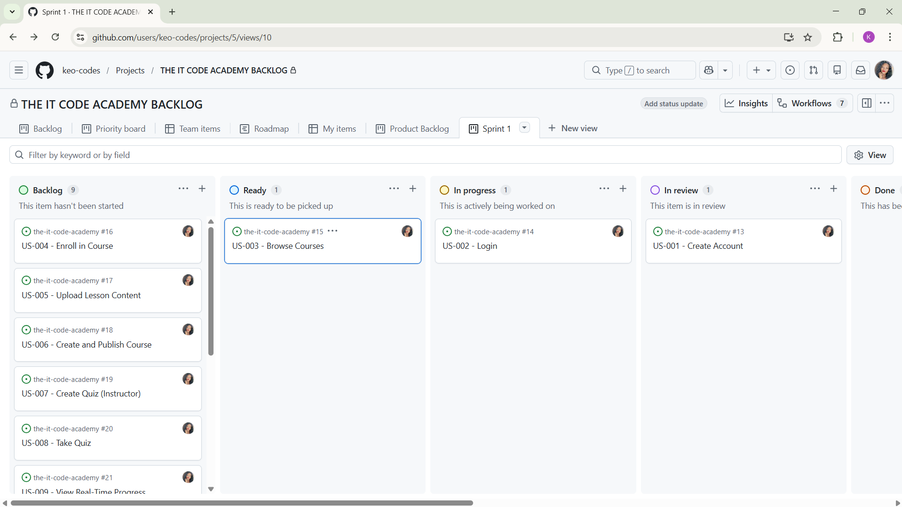

# KANBAN BOARD EXPLANATION

**What is a Kanban board?**  
In my own words, a Kanban board is a visual project management tool that shows the flow of work moving through different stages, like a living dashboard that helps me see exactly where every task stands at any moment.

**How our THE IT CODE ACADEMY Kanban board works**  
Our board (Sprint 1 view) is built on the Kanban template and customised with additional columns to match real development needs for an educational platform:

- **Visualises workflow**: The columns (Backlog → Ready → In Progress → Code Review → Testing → Blocked → Done) clearly represent each stage of development. At a glance I can see exactly where every user story from Assignment 6 is in the process.
- **Limits Work-in-Progress (WIP)**: I keep a soft limit of 3 tasks in “In Progress” and “Code Review”. This prevents me from starting too many things at once, helps me focus on finishing tasks, and avoids bottlenecks.
- **Supports Agile principles**: The board makes problems visible immediately (especially in the Blocked column), encourages continuous delivery (cards move right as work is completed), and allows quick adaptation of priorities. It turns the static sprint plan from Assignment 6 into a dynamic, real-time tool that supports transparency and collaboration.

**Screenshot of the final customised Kanban board**  

This board has already helped me stay organised and motivated while building the MVP. It is not just a diagram for the assignment — it is a practical tool I will keep using for the rest of the project.

